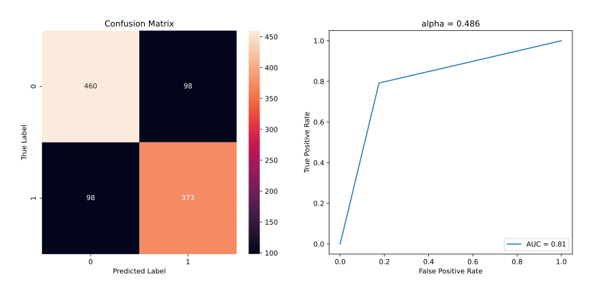

# Banknote Authentication via Least Squares

*Numerical Optimization and Large Scale Linear Algebra*  
*MSc in Data Science, Department of Informatics*  
*Athens University of Economics and Business*

## *Table of Contents*

1. [Project Overview](#project-overview)
2. [Data](#data)
3. [Resources](#resources)
4. [Predictions](#predictions)

## *Project Overview*

- Our aim in this project is to predict whether a given banknote is authentic given a number of measures
- We will use the least squares procedure to create a classifier
- We classify our items based on the following assumption:
    - *"If the prediction value > $0.5$, then we classify the item as 1, otherwise as 0"*
- Then, we will compute the confusion matrix for the training set and check the number of FP and FN responses
- If there is a serious imbalance between FN and FP, we will find a value $α$ that balances the two numbers
- For the optimal value of $\alpha$, we will run the model for the test set
- We will compute, again, the confusion matrix and the error rate for both sets
- Finally, we will use any appropriate transformation technique to increase the accuracy of the model

## *Data*

- The data were provided in the context of the course content
- However, they are also available in the [UCI Machine Learning Repository](https://archive-beta.ics.uci.edu/ml/datasets/banknote+authentication)

## *Resources*

- Packages: `numpy`, `pandas`, `matplotlib`, `seaborn`, `scipy`, `sklearn`
- Software: Jupyter Notebook

## *Predictions*

### Compute the confusion matrix using the least squares classifier

- We see that there is a serious imbalance between *false negative* and *false positive* predictions
- Therefore, we will try to find - *heuristically* - a value of $\alpha$ that balances the two number
- After we found the optimal value of $\alpha$, we will run the model both for train and test set
- For each set, we will calculate the error rate and compute the confusion matrix and the ROC curve

### Results for train set

### Results for test set

- We see that we managed to balance the number between *false negatives* and *false positives* responses
- However, we don't get the best possible results yet and there is room for improvement
- A great way to increase the accuracy of our results would be to scales the feature values prior training
- To decide which type of scaling to apply, we will run the Shapiro-Wilk test
- We will try to detect whether the population of features under consideration is normally distributed

### Shapiro-Wilk

*Hypothesis*

- $H0:$ The sample (obtained from `feature_name`) comes from a normal distribution
- $H1:$ The sample (obtained from `feature_name`) does not come from a normal distribution

*Results*

- Reject the null hypothesis if p-value < 0.05

- According to the graphs, none of the features seems to follow a normal distribution
- In addition, the p-value obtained from Shapiro-Wilk is less than 5% for all the features
- That indicates that none of the samples tested comes from a normal distrubution
- Therefore, we reject the null hypothesis and we will *normalize* our data using `MinMaxScaler`
- Finally, we will find the new optimal value of $\alpha$ and compute, again, the confusion matrices and ROC curves

### Results for train set after normalization

### Results for test set after normalization

### Comments

- We see that scaling our features resulted in different optimal values for $\alpha$
- Furthermore, even though the difference between FP and FN is higher than before, the error rate is smaller
- Finally, we can see that when the model is trained on the scaled features, it yields a higher AUC score
